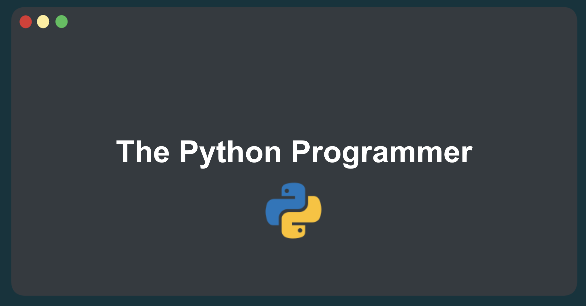

# 100 Exercises - The Python Programmer Course

This repository contains exercises for the Udemy course [The Python Programmer](https://www.udemy.com/course/the-python-programmer/?referralCode=0E6873F6B226E1C591CD) designed and maintained by [Shehab Abdel-Salam](https://www.udemy.com/user/shehab-abdel-salam-2/).

The course is divided into chapters, each containing exercises and tests. The exercises are designed to help students practice Python programming concepts, while the tests are used to verify the correctness of their solutions.

<div style="text-align: center;">
    
</div>

## 1. Structure

The repository has the following structure:

```
├── chapters/
│   ├── chapter1/
│   │   ├── exercises/
│   │   │   ├── exercise_ch1_01.py
│   │   │   ├── exercise_ch1_02.py
│   │   │   └── ...
│   │   └── tests/
│   │       └── test_ch01.py
│   ├── chapter2/
│   │   ├── exercises/
│   │   │   ├── exercise_ch2_01.py
│   │   │   ├── exercise_ch2_02.py
│   │   │   └── ...
│   │   └── tests/
│   │       └── test_ch02.py
│   └── ...
├── ninja_challenges/
│   ├── exercises/
│   │   ├── challenge_01.py
│   │   ├── challenge_02.py
│   │   └── ...
│   └── tests/
│       └── test_ninja_challenges.py
```

The `chapters` directory contains subdirectories for each chapter in the course. Each chapter directory contains an `exercises` directory for the exercises, a `tests` directory for the tests, and a `main.py` file for testing your code.

The `ninja_challenges` directory contains additional challenges for you to practice more once you complete the course. It also has an `exercises` directory for the challenges and a `tests` directory for the tests.

---

## 2. Getting Started

### 2.1 Prerequisites

Before you begin, ensure you have the following installed on your machine:

- Python **3.12** or higher
- `pip` package manager
- `pytest` testing framework

To check if you have Python installed, run the following command in your terminal:

```bash
python --version
```

If you get a `command not found: python`, you can download and install Python from the official website: [Python Downloads](https://www.python.org/downloads/)

To check if you have `pip` installed, run the following command in your terminal:

```bash
pip --version
```

If you get a `command not found: pip`, you can install `pip` by following the instructions on the official website: [Installing pip](https://pip.pypa.io/en/stable/installation/)

To install **`pytest`**, run the following command in your terminal:

```bash
pip install pytest
```

This will install the latest version of `pytest` on your machine.

> This repository was last tested with `pytest` version **8.3.2**.

> Note that you may need to use `pip3` instead of `pip` depending on your Python installation.

---

### 2.2 Setup

First, make sure to clone the repository to your local machine using the following command:

```bash
git clone https://github.com/shehab-as/The-Python-Programmer.git
```

Afterwards, navigate to the repository directory:

```bash
cd The-Python-Programmer/
```

---

### 2.3 Running the Exercises

1. Navigate to the chapter you are working on:

   ```bash
   cd chapters/chapter01_intro
   ```

2. Edit the main.py file to write your solution or test your code.

   ```bash
   python main.py
   ```

3. Write your solution in the corresponding exercise file. For example, if you are working on exercise 1 in chapter 1, you should write your solution in the `exercise_00.py` file.

4. Run the test to verify the correctness of your solution.

   > Note: Always use the `-k` flag to run a specific test.

   ```bash
   pytest -k e00
   ```

   <details><summary>Click to see the following output if the test fails:</summary>

   ```bash
   tests/test_ch01.py:5: AssertionError
   =========================================== short test summary info ===========================================
   FAILED tests/test_ch01.py::test_e00 - AssertionError: assert 'I am ready to learn ______!' == 'I am ready to learn Python!'
   =========================================== 1 failed in 0.01s ===========================================
   ```

   </details>

   <details><summary>Click to see the following output if the test passes:</summary>

   ```bash
   tests/test_ch_01.py .                                                                                [100%]

   =========================================== 1 passed in 0.01s =============================================
   ```

   </details>

   **Optional: You can run all the tests for the chapter you are currently working on:**

   ```bash
   pytest tests/
   ```

5. If the test fails, you will see an error message indicating the reason for the failure. Fix the issue in your code and run the test again.

6. Repeat **steps 2-5** for each exercise in the chapter.

7. Once you have completed all the exercises in the chapter, you can move on to the next chapter and repeat the process.
   ```bash
   cd ../chapter02_variables
   ```

---

## 3. [Optional] Running the Ninja Challenges

> Problems are inspired by [EPI](https://elementsofprogramminginterviews.com/) book and [LeetCode](https://leetcode.com/).

1. Navigate to the ninja challenges directory:

   ```bash
   cd ninja_challenges/
   ```

2. Edit the main.py file to write your solution or test your code.

   ```bash
   python main.py
   ```

3. Run the test to verify the correctness of your solution.

   > Note: Always use the `-k` flag to run a specific test.

   ```bash
   pytest -k challenge_01
   ```

---

## 4. Reporting Issues

If you have any questions or would like to report an issue, you can [click here to raise an issue](https://github.com/shehab-as/The-Python-Programmer/issues/new) on the repository and I'll make sure to review them as soon as possible.

Happy coding! 🐍
